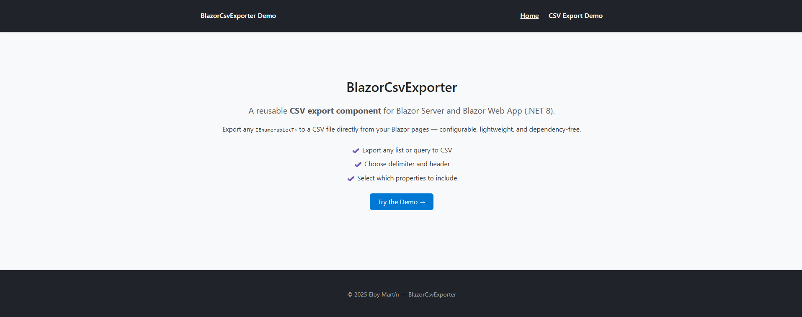

# 📄 Blazor CSV Exporter

> A reusable **CSV export component** for Blazor Server and Blazor Web App (.NET 8) — fully dependency-free and easy to integrate.




---

## ✨ Features

- ⚙️ **No dependencies** — uses pure C# and built-in Blazor tools  
- 🧩 **Reusable component** — works with any `IEnumerable<T>` data source  
- 🪶 **Lightweight** — no external CSV libraries required  
- 💡 **Configurable options** — choose delimiter, include headers, and select columns  
- 💾 **Instant download** — generates and downloads the CSV directly in the browser  

---

## 🚀 Quick Start

### 1️⃣ Install or copy the component

Clone the repository or copy these folders into your project:

```
BlazorCsvExporter/
├── Components/
│   └── CsvExporter.razor
├── Models/
│   └── CsvOptions.cs
├── Services/
│   └── CsvService.cs
└── wwwroot/
    └── csvDownloader.js
```

Then, register the service in your `Program.cs`:

```csharp
using BlazorCsvExporter.Services;

builder.Services.AddScoped<CsvService>();
```

And reference the JavaScript helper in your root `_Host.cshtml` or `index.html`:

```html
<script src="_content/BlazorCsvExporter/csvDownloader.js"></script>
```

---

## 🧱 Example Usage

```razor
@page "/export-demo"
@using BlazorCsvExporter.Components

<h3>Employee List</h3>

<CsvExporter TItem="Employee"
             Data="@employees"
             FileName="Employees.csv"
             IncludeHeader="true"
             Delimiter=";"
             ButtonText="Download CSV" />

@code {
    private List<Employee> employees = new()
    {
        new() { Name = "John",  Department = "IT",       Salary = 45000 },
        new() { Name = "Anna",  Department = "HR",       Salary = 42000 },
        new() { Name = "Peter", Department = "Finance",  Salary = 50000 }
    };

    public class Employee
    {
        public string Name { get; set; } = string.Empty;
        public string Department { get; set; } = string.Empty;
        public int Salary { get; set; }
    }
}
```

---

## ⚙️ Component Parameters

| Parameter        | Type                     | Default        | Description |
|------------------|--------------------------|----------------|--------------|
| `Data`           | `IEnumerable<TItem>?`    | —              | Data source to export |
| `FileName`       | `string`                 | `"export.csv"` | Name of the CSV file |
| `IncludeHeader`  | `bool`                   | `true`         | Include header row |
| `Delimiter`      | `string`                 | `";"`          | CSV delimiter |
| `Columns`        | `IEnumerable<string>?`   | `null`         | Columns to include (optional) |
| `ButtonText`     | `string`                 | `"Export CSV"` | Button label |
| `OnCsvGenerated` | `EventCallback<string>`  | —              | Event triggered with CSV content |

---

## 🧠 How It Works

1. The component builds a CSV string using reflection (`CsvService.GenerateCsv<T>`).  
2. The result is encoded to Base64.  
3. A small JavaScript helper creates a downloadable file directly in the browser.

No temporary files. No server-side storage. Just pure client download.

---

## 🧪 Demo Project

A complete demo is included under:

```
BlazorCsvExporter.Demo/
```

It showcases:
- Interactive delimiter and column selection  
- CSV preview  
- Clipboard copy button  

---

## 🖼️ Screenshots

### Home


### CSV Export Example


---

## 🪪 License

This project is licensed under the [MIT License](LICENSE.txt).  
© 2025 Eloy Martín — Blazor CSV Exporter

---

## 💬 About

Created with ❤️ in Augsburg, Germany.  
If you find this component useful, consider giving it a ⭐ on [GitHub](https://github.com/el mavedev/BlazorCsvExporter)!
